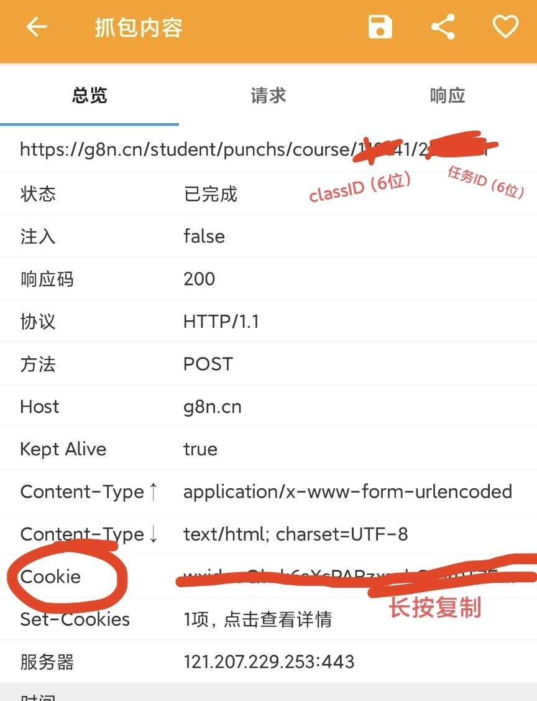
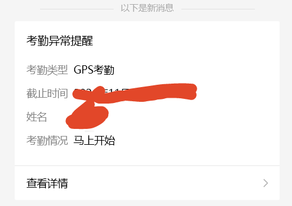
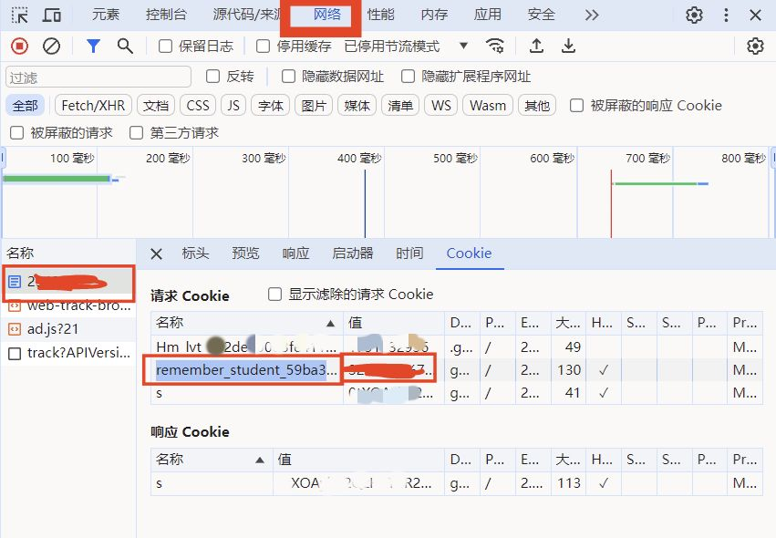

# 班级魔方多人GPS自动签到

- Thanks To [JasonYANG170/AutoCheckBJMF](https://github.com/JasonYANG170/AutoCheckBJMF)
- 仅根据自己学校的班级魔方需求更改简化代码,仅支持GPS签到(可在范围外)，其他功能请到项目[AutoCheckBJMF](https://github.com/JasonYANG170/AutoCheckBJMF)项目查看其他内容
- 可配置多人签到
- 可配置QQ/WX通知签到情况
- 如果你觉得好用,`Please Star`orz
## 功能

- 自动从指定课程中获取签到项
- 通过模拟表单提交，实现自动签到
- 签到成功后，发送QQ/WX消息通知（可选配,可以不用配置）

## 安装依赖

在使用该脚本之前，请确保安装以下依赖项：
```bash
    pip install -r requirements.txt
```


## 配置

该脚本需要读取一个名为 `data.json` 的文件，其中包含必要的配置信息。请参考以下格式配置 `data.json` 文件：
```json
 {
            "name": "xxx",
            "class": "xxxxxx",
            "lat": "xxxxxx",
            "lng": "xxxxxx",
            "acc": "xxx",
            "cookie": "xxxx",
            "QmsgKEY": "",
            "WXKey": ""
        },
```
- 只需要配置json文件即可;
- py文件可根据实际需求更改

### 参数说明:
- `name`: - 随便写,只是方便区分
- `class` - BJMF里的课程 `ID`
- `lat` - 纬度
- `lng` - 经度
- `acc` - 海拔高度
- `cookie` - 从浏览器中获取的 `cookie` 信息，用于模拟登录状态
- `QmsgKEY` - Qmsg 服务的消息推送密钥，用于QQ发送消息(选填)
- `WXKey` - Server酱-Turbo版,用于微信通知消息(选填)

### 参数获取方法
- `class` - 使用抓包工具(比如`HttpCanary`,教程[点击这里](https://blog.csdn.net/weixin_53891182/article/details/124739048) ); 抓取一次签到过程,在过滤(Url关键词或者其他)界面中查找`g8n`
  - 具体视实际情况而定,了解到有的是`k8n`,有的是`g8n`;代码里是`g8n`,若有不同记得修改;
  - 之后应该只有一条POST请求,为`https://g8n.cn/student/punchs/course/xxxxxx/yyyyyy`, 其中的`xxxxxx`就是六位数的课程ID,`yyyyyy`就是具体的签到任务,这里不用管yyyyyy,代码中会自动获取
- `lat` 和 `lng` - 使用地图工具获取当前位置的经纬度,
  - 比如[高德地图的坐标拾取器](https://lbs.amap.com/tools/picker), 进去搜索自己的位置即可获取经纬度
- `acc` - 海拔高度
  - 随便写个数字即可, 这里不用管
- `cookie` - 从浏览器中获取的 `cookie` 信息，用于模拟登录状态
  - 方法1:使用抓包工具获取 
  - 方法2:使用浏览器开发者工具(F12)查看`cookie`信息, 复制`cookie`信息
- `QmsgKEY` - Qmsg 服务的消息推送密钥，用于发送QQ成功签到通知
  - Qmsg 官网注册账号即可获取 [Qmsg官网](https://qmsg.zendee.cn/), 教程在官网自行查询
  - 如果你使用的是特殊网络下的主机遇到Qmsg发送不了的错误,比如`10054远程主机关闭了连接`之类的,按照给出的网址修改`DNS`进行改进(至少我改过之后就不报错了)[点击链接](https://blog.csdn.net/itnerd/article/details/106764904)
- `WXKey` - Server酱-Turbo版 服务的消息推送密钥，用于发送微信成功签到通知
  - Server酱-Turbo版 官网微信扫码关注公众号获取 [Server酱官网](https://sct.ftqq.com/), 教程在官网自行查询

### 抓包软件使用方法
- 签到前打开抓包工具
- 进入VX进行签到
- 返回到抓包工具, 过滤(Url关键词或者其他)界面中查找`g8n`找到Post请求, 复制其中的`cookie`和`classID`;这里的`cookie`全部复制就行
- 更详细方法请自行搜索
- 电脑打开微信也可以在网址栏查看`class ID`,F12可以查看发送请求的`Cookie`(目前只看到了`classID`,`Cookie`可以尝试`F12`->`网络`中进行`POST`包的过滤查找,步骤在后面,往下滑查看) 
- 更详细的使用和安装方法:[点击链接](https://blog.csdn.net/weixin_53891182/article/details/124739048)

[//]: # (![抓包界面]&#40;doc/img1.jpg&#41;)
- 

### 浏览器获取Cookie方法
- 这个方法可以在任意时候使用
- 电脑登录微信,点击签到项,使得浏览器打开签到页面
  - [//]: # (![微信签到页面]&#40;doc/img1.jpg&#41;)
  - 
  - [//]: # (![浏览器查看班级码]&#40;doc/img1.jpg&#41;)
  - 
  - 这边的浏览器网址有两个框;左边的六位数就是`班级ID`,右边的就是具体的签到任务,这里不用管右边的,代码中会自动获取
- 按F12打开开发者工具,切换到`网络`(`Network`)标签,侧边栏找到一个全是数字的标签,再在打开的页面中点击Cookie,如下所示:
  - [//]: # (![浏览器查看Cookie]&#40;doc/img1.jpg&#41;)
  - 
- 在我使用红色框选中的地方复制`Cookie`信息,粘贴到`data.json`文件中即可
- 注意: 这个方法获取的`Cookie`需要进行拼接,假设左侧框获取的为A(即`remember_student_59ba36addc2b2f9401580f014c7f58ea4e30989d`,这个是固定的),右侧框获取的为B(即`aaaaaa%bbbbbbb%cccccc`),那么最终的`Cookie`信息为`A=B`
- PS:浏览器可能在此页面右键无法直接复制内容,可以先对内容进行双击,再复制;同时若这部分的cookie中含有`%`符号,则双击选中的部分会被该符号阶段;可将鼠标悬停在其上方进行分段复制再使用%进行连接;
- 总之,最终获取到的样式应该为: `remember_student_59ba36addc2b2f9401580f014c7f58ea4e30989d=aaaaaaaa%bbbbbbbbbbbbbb%cc`

### 使用方法

- 配置 `data.json` 文件，确保填入正确的课程信息和其他配置项
- 运行脚本 `BJMF.py`：

```bash
python BJMF.py
```

脚本将自动完成签到操作，并在成功签到后发送通知(如果有配置 Qmsg 服务的话)。

### 自动方法:
- 使用一台常年不关的电脑或者服务器设置定时任务即可自动签到
  - windows 系统: 使用计划任务设置定时任务 [教程](https://blog.csdn.net/weixin_38792396/article/details/121490505)
    - 此电脑(右键)->管理->系统工具->任务计划程序->任务计划程序库
  - linux 系统: 使用 `crontab` 设置定时任务 [教程](https://geek-docs.com/python/python-ask-answer/815_python_execute_python_script_via_crontab.html)
  - 或者使用云服务定时任务, 比如腾讯云函数, 阿里云函数计算, 百度云函数计算等 教程自行搜索

### 未来打算
- 多人签到(√)
- 一检测到新任务就签到(×)
- 画饼:
  - 打包成 `exe` , 供电脑上没有安装`python`环境的电脑签到(×)
  - 打包成 `app` , 供手机上使用自动任务完成签到(×)
