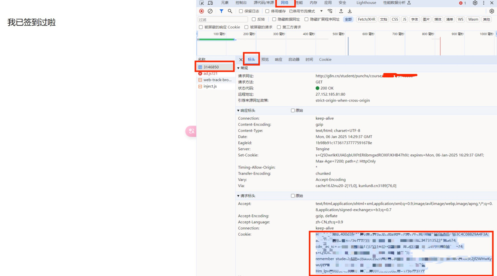

# 班级魔方多人GPS自动签到

- Thanks To [JasonYANG170/AutoCheckBJMF](https://github.com/JasonYANG170/AutoCheckBJMF) ，根据自己学校的签到进行了简化
- 仅根据自己学校的班级魔方需求更改简化代码,仅支持GPS签到(可在范围外)，其他功能请到项目[AutoCheckBJMF](https://github.com/JasonYANG170/AutoCheckBJMF)项目查看其他内容
- 可配置多人签到
- 可配置QQ/WX通知签到情况
- 如果你觉得好用,`Please Star`orz

## 代码结构

项目已进行模块化重构，提高了代码的可维护性和可读性：

```
BJMF/
├── BJMF.py                 # 主程序，负责整体流程控制
├── auto_add_user.py        # 自动添加用户工具，通过微信扫码获取用户信息并写入配置data.json
└── utils/                  # 工具模块目录
    ├── __init__.py         # 模块初始化文件
    ├── config_manager.py   # 配置文件管理模块
    ├── user_info.py        # 用户信息获取模块
    ├── notification.py     # 通知发送模块
    └── attendance.py       # 签到任务执行模块
```

### 各模块职责

- **BJMF.py**: 主程序入口，负责读取配置、遍历用户、调用签到任务
- **auto_add_user.py**: 自动添加用户工具，通过微信扫码获取用户信息并写入data.json配置文件
- **config_manager.py**: 处理配置文件的读取和保存
- **user_info.py**: 获取用户信息和班级信息
- **notification.py**: 处理QQ和微信消息发送
- **attendance.py**: 执行签到任务的核心逻辑

这种模块化结构使代码更易于维护、测试和扩展。

## 功能

- 自动从指定课程中获取签到项
- 通过模拟表单提交，实现自动签到
- 签到成功后,发送QQ/WX消息通知(可选配,可以不用配置)

## 更新说明

- 2025.12.04 v2版本
  - 新增 `auto_add_user.py` 工具，实现微信扫码自动获取用户信息并写入配置文件data.json,
    - 无需手动获取Cookie和班级ID,直接通过微信扫码即可添加用户(但是依旧需要在data.json中根据签到范围配置经纬度)
  - 简化了用户添加流程，无需手动获取Cookie和班级ID

- 2025.10.14 v2版本
  - 调整文件结构

- 2025.9.14 v2版本，修复了一些bug,新增了一些功能
  - 班级码自动获取
  - 输出用户相关信息，用于核对，因为即使是过时/错误的Cookie依旧可以进入页面返回200,所以需要检查一下用户信息是否正确


## 安装依赖

在使用该脚本之前，请确保安装以下依赖项：
```bash
    pip install -r requirements.txt
```


## 配置

该脚本需要读取一个名为 `data.json` 的文件，其中包含必要的配置信息。请参考以下格式配置 `data.json` 文件：
```json
 {
            "name": "xxx",
            "class": "xxxxxx",
            "lat": "xxxxxx",
            "lng": "xxxxxx",
            "acc": "xxx",
            "cookie": "xxxx",
            "QmsgKEY": "",
            "WXKey": ""
        },
```
- 只需要配置json文件即可;
- py文件可根据实际需求更改

### 参数说明:
- `name`: - 随便写,只是方便区分
- `class` - BJMF里的课程 `ID`
- `lat` - 纬度
- `lng` - 经度
- `acc` - 海拔高度
- `cookie` - 从浏览器中获取的 `cookie` 信息，用于模拟登录状态
- `推送参数`
  - `QmsgKEY` - Qmsg 服务的消息推送密钥,用于QQ发送消息(选填)
  - `WXKey` - Server酱-Turbo版,用于微信通知消息(选填)

### 参数获取方法
- `class` - 使用抓包工具(比如`HttpCanary`,教程[点击这里](https://blog.csdn.net/weixin_53891182/article/details/124739048) ); 抓取一次签到过程,在过滤(Url关键词或者其他)界面中查找`g8n`
  - 具体视实际情况而定,了解到有的是`k8n`,有的是`g8n`;代码里是`g8n`,若有不同记得修改;
  - 之后应该只有一条POST请求,为`https://g8n.cn/student/punchs/course/xxxxxx/yyyyyy`, 其中的`xxxxxx`就是六位数的课程ID,`yyyyyy`就是具体的签到任务,这里不用管yyyyyy,代码中会自动获取
- `lat` 和 `lng` - 使用地图工具获取当前位置的经纬度,
  - 比如[高德地图的坐标拾取器](https://lbs.amap.com/tools/picker), 进去搜索自己的位置即可获取经纬度
- `acc` - 海拔高度
  - 随便写个数字即可, 这里不用管
- `cookie` - 从浏览器中获取的 `cookie` 信息，用于模拟登录状态
  - 方法1:使用抓包工具获取 
  - 方法2:使用浏览器开发者工具(F12)查看`cookie`信息, 复制`cookie`信息
- `QmsgKEY` - Qmsg 服务的消息推送密钥,用于发送QQ成功签到通知
  - Qmsg 官网注册账号即可获取 [Qmsg官网](https://qmsg.zendee.cn/), 教程在官网自行查询
  - 如果你使用的是特殊网络下的主机遇到Qmsg发送不了的错误,比如`10054远程主机关闭了连接`之类的,按照给出的网址修改`DNS`进行改进(至少我改过之后就不报错了)[点击链接](https://blog.csdn.net/itnerd/article/details/106764904)
   - 若修改DNS后依旧无法使用Qmsg,显示错误,比如`远程主机关闭连接`之类的，那么(那么可以将DNS改回来了,说明不是DNS的问题)；可能就需要使用代理；
      - 确保电脑上已经有代理软件(`我使用的是clash,默认的代理端口为7890，那么我的代理就是http://127.0.0.1:7890,不同的软件占用端口视具体情况而定`);在发送消息的代码前加入以下代码：
        ```python
          proxy = "http://127.0.0.1:7890"
          proxies = {
                "http": proxy,
                "https": proxy
          }
        ```
      - 然后在发送消息的函数`send_qq_message`的`post`方法中加入`proxies=proxies`即可,如下所示:
      ```python
        response = requests.post(url, data=message , proxies=proxies)
      ```

- `WXKey` - Server酱-Turbo版 服务的消息推送密钥，用于发送微信成功签到通知
  - Server酱-Turbo版 官网微信扫码关注公众号获取 [Server酱官网](https://sct.ftqq.com/), 教程在官网自行查询

### 抓包软件使用方法
- 签到前打开抓包工具
- 进入VX进行签到
- 返回到抓包工具, 过滤(Url关键词或者其他)界面中查找`g8n`找到Post请求, 复制其中的`cookie`和`classID`;这里的`cookie`全部复制就行
- 更详细方法请自行搜索
- 电脑打开微信也可以在网址栏查看`class ID`,F12可以查看发送请求的`Cookie`(目前只看到了`classID`,`Cookie`可以尝试`F12`->`网络`中进行`POST`包的过滤查找,步骤在后面,往下滑查看) 
- 更详细的使用和安装方法:[点击链接](https://blog.csdn.net/weixin_53891182/article/details/124739048)

[//]: # (![抓包界面]&#40;doc/img1.jpg&#41;)
- 

### 浏览器获取Cookie方法
- 这个方法可以在任意时候使用
- 电脑登录微信打开`http://g8n.cn/student/login?ref=%2Fstudent`,点登录,打开签到页面
  - [//]: # (![微信签到页面]&#40;doc/img1.jpg&#41;)
  - 
  - [//]: # (![浏览器查看班级码]&#40;doc/img1.jpg&#41;)
  - 
  - 这边的浏览器网址有两个框;左边的六位数就是`班级ID`,右边的就是具体的签到任务,这里不用管右边的,代码中会自动获取
- 按F12打开开发者工具,切换到`网络`(`Network`)标签,侧边栏找到一个全是数字的标签,再在打开的页面中点击Cookie,
- 直接复制图中淡蓝色选中部分：


## 使用方法

### 自动添加用户

1. 确保已安装所有依赖（见安装依赖部分）
2. 运行自动添加用户工具：
   ```
   python auto_add_user.py
   ```
3. 使用微信扫描弹出的二维码进行登录
4. 程序会自动获取用户信息和班级信息，并写入data.json文件
5. 检查生成的data.json文件，根据需要手动修改经纬度信息

### 执行签到任务

1. 确保已安装所有依赖（见安装依赖部分）
2. 确保data.json文件已配置好（可通过自动添加用户工具生成）
3. 直接运行签到程序：
   ```
   python BJMF.py
   ```
4. 程序会自动为配置文件中的所有用户执行签到任务

### 注意事项

- 程序会自动检测并填充空的class字段
- 如果用户信息获取失败（如cookie过期），程序会跳过该用户
- 程序运行完成后会自动保存更新后的配置文件
- 按Ctrl+C可以手动中断程序执行

### 自动方法:
- windows 系统: 使用计划任务设置定时任务 [教程](https://blog.csdn.net/weixin_38792396/article/details/121490505)
  - 此电脑(右键)->管理->系统工具->任务计划程序->任务计划程序库
  - linux 系统: 使用 `crontab` 设置定时任务 [教程](https://geek-docs.com/python/python-ask-answer/815_python_execute_python_script_via_crontab.html)
- 或者使用云服务定时任务, 比如腾讯云函数, 阿里云函数计算, 百度云函数计算等 教程自行搜索
